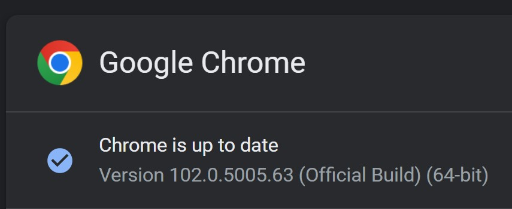
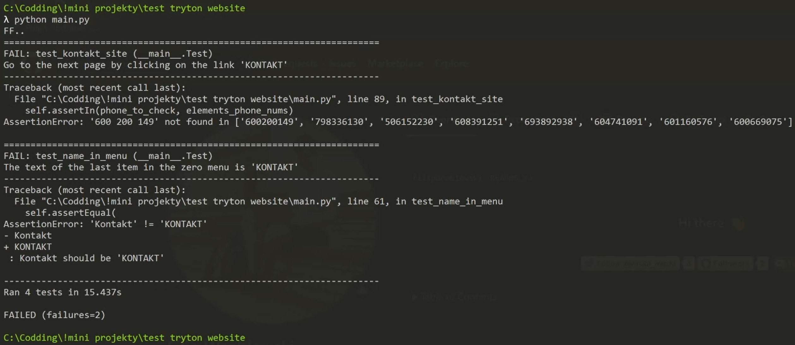

# Testing Tryton website

### Project video presentation

[](http://www.youtube.com/watch?feature=player_embedded&v=TRVwj7NfUkA)

## The description of tests

1. In url _https://tryton.club_ exists title "Tryton".
2. There is exactly one visible item in the zero-level menu containing the word "Kontakt" in the text.
3. The text of the last item in the zero menu is "KONTAKT"
4. Go to the next page by clicking on the link 'KONTAKT'
5. There is a header element with the text 'Poznańskie Towarzystwo Wioślarzy Tryton'.
6. There is a telephone number to the Prezes on the website '600200149'.

## Setup

### Download chrome driver version

1. open chrome app
2. go to settings
3. click _About Chrome_
4. check your Chrome version (mine below)
   
5. open https://chromedriver.chromium.org/downloads
6. get your version (in my case it is 102)
7. unzip compressed files and move your driver to _driver_ folder.

### Files structure

```cmd
FolderName
   ├───driver
   |     └───chromedriver.exe
   ├───img
   |    ├───chrome_version.jpg
   ├───README.md
   └───main.py
```

### Installation

```cmd
pip install selenium
```

## Running app

### Run from cmd

```cmd
python main.py
```

### Output


